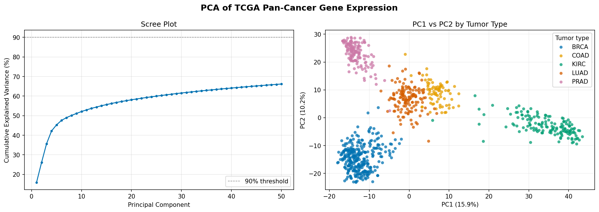
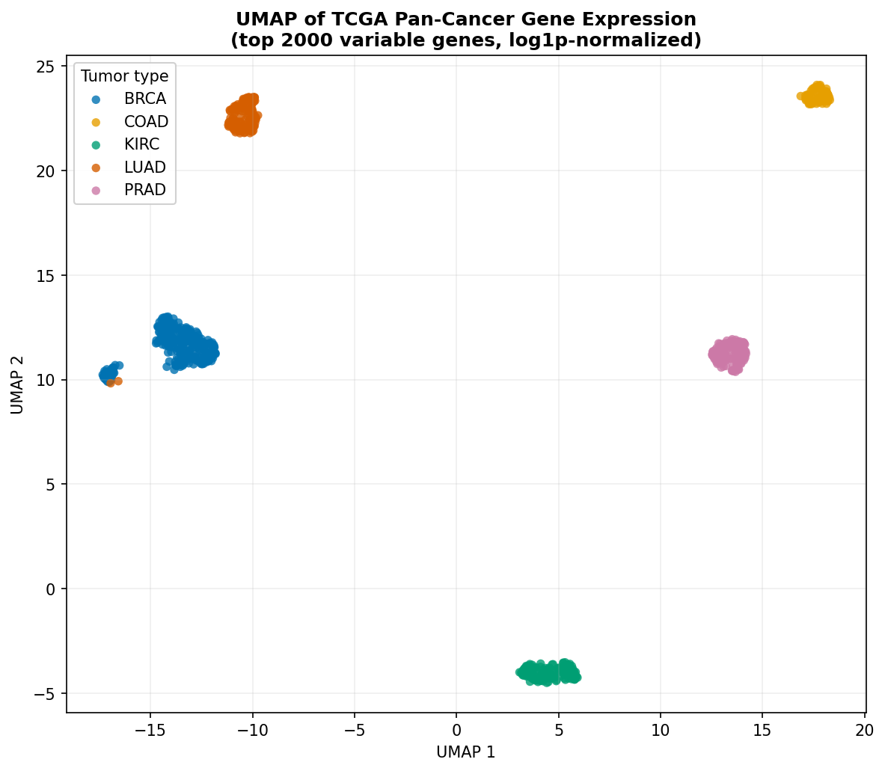
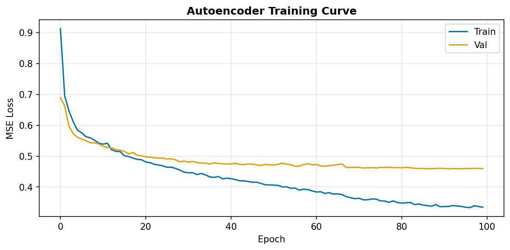
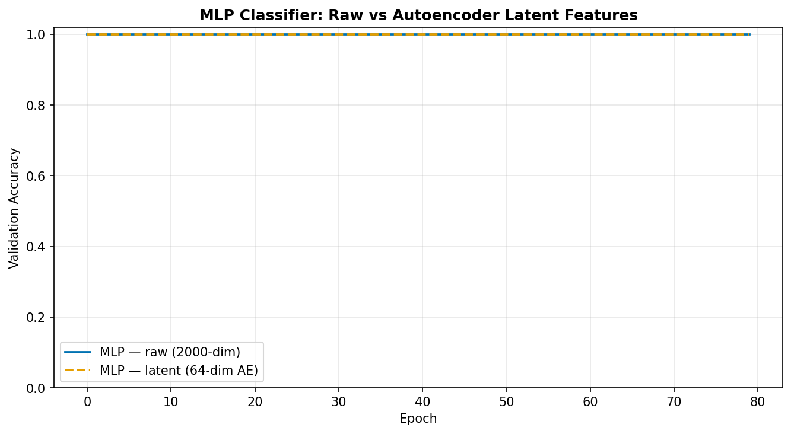
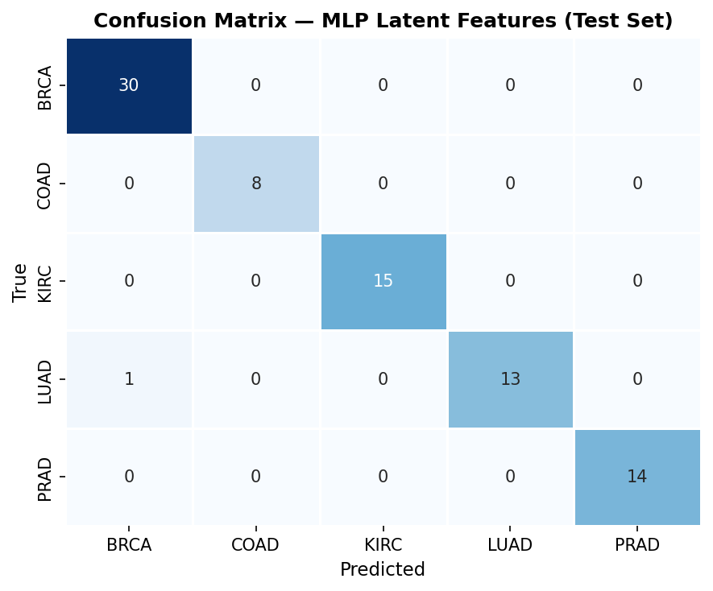

### Pipeline steps

| Script | Description |
|--------|-------------|
| `src/01_download.py` | Downloads and extracts raw TCGA data |
| `src/02_preprocess.py` | log1p normalization, gene filtering, train/val/test split |
| `src/03_explore.py` | PCA and UMAP visualizations |
| `src/04_autoencoder.py` | Trains deep autoencoder, saves 64-dim latent embeddings |
| `src/05_classifier.py` | Trains MLP on raw and latent features |
| `src/06_evaluate.py` | Test set evaluation, confusion matrices, summary figures |

---

## Results

Both models achieve **100% test accuracy** on the held-out test set (81 samples),
consistent with the clearly separable structure visible in UMAP.

| Model | Input dim | Parameters | Test accuracy |
|-------|-----------|------------|---------------|
| MLP — raw features | 2,000 | 1,098,757 | 1.0000 |
| MLP — latent features | 64 | 25,413 | 1.0000 |

The autoencoder compresses gene expression by **97%** (2,000 → 64 dimensions)
with zero loss of classification signal — demonstrating that tumor identity is
encoded in a compact, learnable latent space.

### Visualizations

| PCA | UMAP |
|-----|------|
|  |  |

| Autoencoder loss | Classifier comparison |
|------------------|-----------------------|
|  |  |

| Confusion — Raw | Confusion — Latent |
|-----------------|--------------------|
|  |  |

---

## Reproducing the project

```bash
git clone https://github.com/YOUR_USERNAME/tcga-deep-tumor-classifier
cd tcga-deep-tumor-classifier
python -m venv .venv && source .venv/bin/activate
pip install -r requirements.txt

python src/01_download.py
python src/02_preprocess.py
python src/03_explore.py
python src/04_autoencoder.py
python src/05_classifier.py
python src/06_evaluate.py
```

Data is downloaded automatically (~73 MB). Total runtime: ~5 minutes on CPU.

---

## Tech stack

- **PyTorch** — autoencoder + MLP classifier
- **scikit-learn** — preprocessing, metrics
- **UMAP** — non-linear dimensionality reduction
- **pandas / NumPy** — data handling
- **Matplotlib / Seaborn** — visualization

---

## Relevance to clinical bioinformatics

This project reflects core tasks in molecular pathology data science:
- QC and normalization of NGS-derived expression data
- Unsupervised representation learning (autoencoder) on omics data
- Interpretable ML classification with per-class metrics
- Reproducible, modular pipeline structure

---

*Dataset: Weinstein et al., The Cancer Genome Atlas Pan-Cancer Analysis Project,
Nature Genetics 2013.*